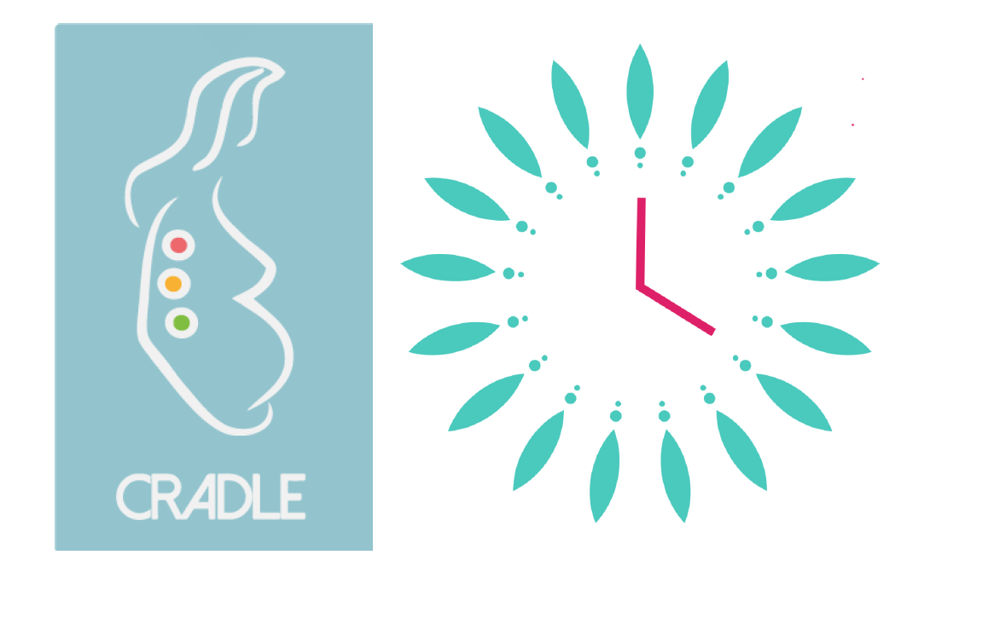

# CRADLE VSA SUPPORT APP



## Overview

*"The Microlife CRADLE VSA [is a device that can] accurately measure blood
pressure and heart rate and uses these values to calculate whether the women is
at risk of developing shock."* (Credit: 
[CRADLE Trial](http://cradletrial.com/the-device/))

VHT (Village Health Team) Workers use the device to read their patients and,
based on the patient's status (denoted by a "red, yellow, green light" system),
VHTs will then make a referral to the appropriate medical facility.

The purpose of this application is to serve as a companion Android app for VHTs
to record their readings on the field into a central database, as well as a
web app for medical workers in proper medical facilities to quickly access the
data that VHTs send, and a database to store the information VHTs enter, as
well as any follow-up information the medical workers enter; this repository
holds the web app as well as the database.

## Features

#### Referral Tool
- Sync readings from VHTs in real-time for health facility workers to access
- Allow health workers to enter readings, diagnoses or treatements and the
  follow-up required by the VHT
- Show most appropriate management for patient from decision algorithm, based
  on patient status (age, pregnancy status, ethnicity, suspected diagnosis,
  etc.)
#### Individual Patient Monitoring
- Store multiple readings for individual patients; allow viewing the data
  trends over time via graphs
- Record medications, as well as date started, date discontinued (if
  applicable), dosage, and side effects
- Alert health workers if readings are abnormal
#### VHT Monthly Reports
- For any referral, VHTs and health workers will be able to view the health
  centre referred to, the distance to the health facility, and the method of
  transportation
#### Educational Tools
- Videos with advice for health care workers

## Directory Structure

```
./
 ├ .mvn/                       Build files
 ├ src/                        Source code
 │  ├ main                     Main source code
 │  │  ├ java                  Java source files
 │  │  └ resources             HTML/CSS/Javascript + other app resources
 │  │     ├ static
 │  │     │  ├ css             CSS files
 │  │     │  ├ images          Image resources
 │  │     │  └ js              Javascript files
 │  │     └ WEB-INF
 │  │        └ view            JSP files
 │  └ test                     Unit tests
 ├ AUTHORS.txt                 Project authors
 ├ LICENSE.txt                 Project license
 ├ README.md                   Project Readme (this file)
 ├ mvnw
 ├ mvnw.cmd
 └ pom.xml
```

## Dependencies

- JDK 1.8+
- Maven 3+
- MySQL

## Build/Run Instructions

If hosting MySQL on a remote server, edit the following values in
`src/main/resources/application.properties` as necessary:
```
spring.datasource.url=jdbc:mysql:[url:port/database]
spring.datasource.username=[username]
spring.datasource.password=[password]
```
Change into cloned directory and run:
```
$ ./mvnw package
```
The .jar will be built to `./target/`; to run from the cloned directory, run:
```
$ java -jar ./target/TeamMercuryCradlePlatform-0.0.1-SNAPSHOT.jar
```

## License

This project is licensed under the 3-Clause "New" BSD License; see LICENSE.txt
for more details.
